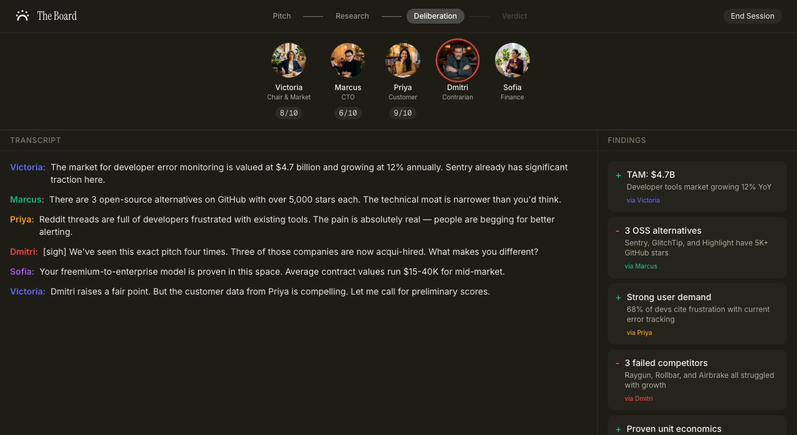

# The Board — AI Board of Directors

> Pitch your startup idea to 5 AI board members who research, debate, and vote — all in real-time voice.

**[Try it live](https://the-board-ai.vercel.app)** | Built for [ElevenHacks 2026](https://hacks.elevenlabs.io)



## How It Works

1. **You pitch** — Describe your startup idea, paste a URL, or dictate with your voice
2. **They research** — Each board member searches the live web for market data, competitors, customer pain points, technical feasibility, and financials
3. **They debate** — Board members argue and disagree based on their findings
4. **They vote** — Invest, pass, or abstain. A final verdict is delivered with an overall score

The entire meeting runs autonomously. No prompting, no clicking. Just pitch and watch.

## The Board Members

| Member | Role | Specialty |
|--------|------|-----------|
| **Victoria Sterling** | Chair & Market Strategist | Market size, TAM, growth trends |
| **Marcus Chen** | CTO | GitHub, open source, technical feasibility |
| **Priya Kapoor** | Customer Advocate | Reddit, forums, real user pain points |
| **Dmitri Volkov** | Devil's Advocate | Failed startups, competitors, bear cases |
| **Sofia Reyes** | Finance | Pricing models, unit economics, revenue |

## Tech Stack

| Layer | Technology |
|-------|-----------|
| Voice AI | [ElevenLabs Conversational AI](https://elevenlabs.io) — single agent, 5 voices via multi-voice support |
| Web Research | [Firecrawl](https://firecrawl.dev) Search API — real-time research during the meeting |
| Frontend | Next.js 16, React 19, TypeScript, Tailwind CSS 4 |
| UI | shadcn/ui, custom board room interface |
| Deployment | Vercel |

## Architecture

```
User pitches idea
  ↓
BoardRoom component mounts
  ├── Optional: Firecrawl scrapes startup URL for context
  ├── ElevenLabs WebSocket connects (signed URL)
  ├── Agent receives pitch as dynamic variable
  │
  ├── Research Phase
  │   └── Agent calls 5 webhook tools → /api/tools/{market,tech,customer,competitor,finance}
  │       └── Each tool → Firecrawl Search API → results fed back to agent
  │
  ├── Deliberation Phase
  │   └── Board members debate findings using multi-voice
  │
  └── Verdict Phase
      └── All 5 members vote → final score + verdict overlay
```

## Getting Started

### Prerequisites

- Node.js 20+
- [ElevenLabs](https://elevenlabs.io) API key with a Conversational AI agent configured
- [Firecrawl](https://firecrawl.dev) API key

### Setup

```bash
git clone https://github.com/sergical/the-board.git
cd the-board
npm install
```

Create `.env.local`:

```
ELEVENLABS_API_KEY=your_key
NEXT_PUBLIC_ELEVENLABS_AGENT_ID=your_agent_id
FIRECRAWL_API_KEY=your_key
```

```bash
npm run dev
```

Open [http://localhost:3000](http://localhost:3000).

## Key Files

```
src/
├── app/
│   ├── page.tsx                    # Landing page
│   ├── pitch/page.tsx              # Pitch input + board room
│   └── api/
│       ├── conversation-token/     # ElevenLabs signed URL
│       ├── scrape-startup/         # Firecrawl URL scraping
│       └── tools/                  # Research webhook endpoints
│           ├── market/
│           ├── tech/
│           ├── customer/
│           ├── competitor/
│           └── finance/
├── components/board/               # Board room UI
│   ├── board-room.tsx              # Main orchestration + useConversation
│   ├── agent-panel.tsx             # 5 avatar cards with scores
│   ├── transcript-panel.tsx        # Live transcript
│   ├── findings-panel.tsx          # Research findings sidebar
│   └── verdict-overlay.tsx         # Final verdict modal
└── lib/
    ├── board-state.ts              # Types + board member definitions
    └── firecrawl.ts                # Firecrawl search utility
```

## License

MIT
